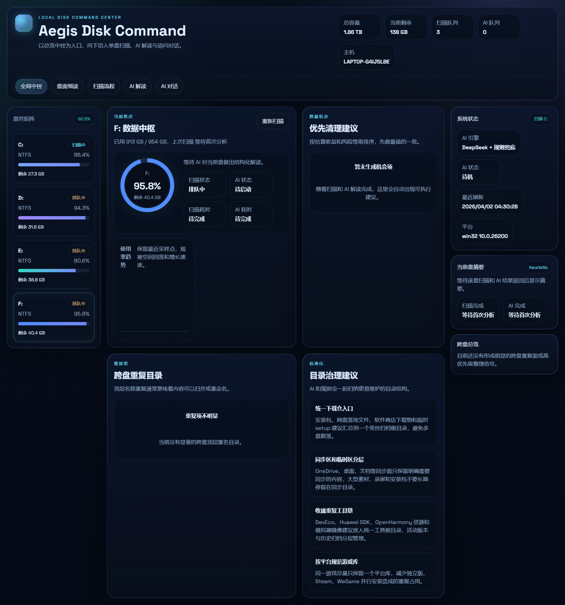

# Aegis Disk Command

[English README](./README.en.md)

[](https://github.com/XXYoLoong/aegis-disk-command/stargazers)
[](https://github.com/XXYoLoong/aegis-disk-command/network/members)
[](https://github.com/XXYoLoong/aegis-disk-command/issues)
[](https://www.microsoft.com/windows)
[](https://react.dev/)
[](https://vite.dev/)
[](https://nodejs.org/)
[](https://learn.microsoft.com/powershell/)
[](https://api-docs.deepseek.com/)

本地磁盘实时驾驶舱。它不是传统“扫完一次给一张静态报表”的工具，而是一个持续运行的磁盘指挥台：

- 实时读取所有盘的容量、扫描队列和 AI 分析状态
- 用单次遍历扫描器输出盘面热点、显著文件、缓存机会和跨盘重复项
- 将扫描流程可视化，直接看到当前根目录、路径、文件数和目录数
- 为每个盘提供 AI 解读，并在分析完成后继续对话追问
- 用多界面工作台代替单一大屏：总览、单盘、扫描、AI、对话分别承载不同任务



## 为什么现在更快

旧版本慢的核心原因不是“PowerShell 本身慢”，而是扫描策略重复了太多 I/O：

- 顶层目录扫一遍
- 热点目录再递归扫一遍
- 为了补充文件信息又重复扫一遍
- AI 分析还会阻塞后续盘符扫描

现在的实现做了两层优化：

1. 扫描优化

- `server/FastScanner.cs` 使用 Win32 `FindFirstFileExW` + `FIND_FIRST_EX_LARGE_FETCH`
- 单次遍历目录树，在遍历过程中同步聚合：
  - 顶层目录大小
  - 聚焦目录下一层子项
  - 显著大文件
  - 扫描进度指标
- `server/scan-drive.ps1` 只负责编译和调用扫描器，不再自己重复递归

2. 分析优化

- `server/index.mjs` 把扫描队列和 AI 队列拆开
- 当前盘一旦完成扫描，下一块盘可以立即开始
- AI 在后台异步补充结构化结论，不再阻塞扫盘流水线

这套方案在当前机器上做过实测：`C:` 默认完整扫描约 `37.4 秒`，相较你之前反馈的约 `7 分钟`，延迟下降非常明显。

## 界面结构

新版前端不是一个单纯大屏，而是一个分层驾驶舱：

- `全局中控`
  - 看整体容量压力、跨盘机会、重复目录和标准化建议
- `盘面细读`
  - 看单盘顶层热点、聚焦目录和显著大文件
- `扫描流程`
  - 看实时进度条、当前路径、根任务推进、文件数和目录数
- `AI 解读`
  - 看当前盘 AI 总结、治理建议和跨盘全局摘要
- `AI 对话`
  - 在分析完成后继续追问“先删什么”“怎么迁移”“怎么标准化”

## 项目结构

```text
disk-command-cockpit/
├─ server/
│  ├─ FastScanner.cs        # Win32 单次遍历扫描器
│  ├─ scan-drive.ps1        # 编译并调用扫描器
│  ├─ ai-analysis.mjs       # DeepSeek 结构化分析 + 对话
│  └─ index.mjs             # API、队列、快照、实时状态
├─ src/
│  ├─ App.tsx               # 多视图工作台壳层
│  ├─ components/
│  │  └─ CockpitViews.tsx   # 各视图与可视化组件
│  ├─ lib/format.ts         # 格式化工具
│  ├─ types.ts              # 快照类型定义
│  └─ index.css             # 深色科技驾驶舱样式
└─ docs/
   └─ step-by-step-log.md   # 过程记录
```

## 启动方式

### 1. 安装依赖

```bash
npm install
```

### 2. 开发模式

```bash
npm run dev
```

默认会同时启动：

- 前端：Vite
- 后端：`node server/index.mjs`

### 3. 生产构建

```bash
npm run build
npm run start
```

## 环境变量

### 可选：启用 DeepSeek

```powershell
$env:DEEPSEEK_API_KEY="your_key"
```

可选参数：

```powershell
$env:DEEPSEEK_BASE_URL="https://api.deepseek.com"
$env:DEEPSEEK_MODEL="deepseek-chat"
$env:DEEPSEEK_TIMEOUT_MS="12000"
```

没有 `DEEPSEEK_API_KEY` 时，系统仍可工作，只是会回退到本地规则分析。

## API 概览

- `GET /api/snapshot`
  - 返回当前全量快照
- `POST /api/rescan`
  - 将指定盘符插入扫描队列
- `POST /api/chat`
  - 基于已完成扫描的盘做 AI 对话
- `GET /api/health`
  - 返回扫描器、AI 队列和模型状态

## 当前分析逻辑

系统会先生成稳定的结构化扫描结果，再叠加 AI：

1. 盘符容量和健康度
2. 顶层热点目录与文件
3. 聚焦目录的下一层展开
4. 显著大文件与缓存机会
5. 跨盘重复项和标准化建议
6. DeepSeek 对每个盘和全局进行结构化解读
7. 分析完成后可继续围绕该盘追问

## 已验证项

- `npm run lint`
- `npm run build`
- `node --check server/index.mjs`
- `node --check server/ai-analysis.mjs`
- `C:` 默认完整扫描实测约 `37.4 秒`
- `GET /api/health` 返回扫描与 AI 状态正常

## 注意事项

- 当前设计目标是“只读分析优先”，不会自动删除或迁移文件
- 扫描速度仍会受到盘符大小、目录碎片度、权限限制和后台占用影响
- AI 对话只在对应盘扫描完成后可用
- 首次启动时 `server/scan-drive.ps1` 会在项目目录下的 `.runtime/` 编译扫描器，不会写到 `C:` 系统盘
