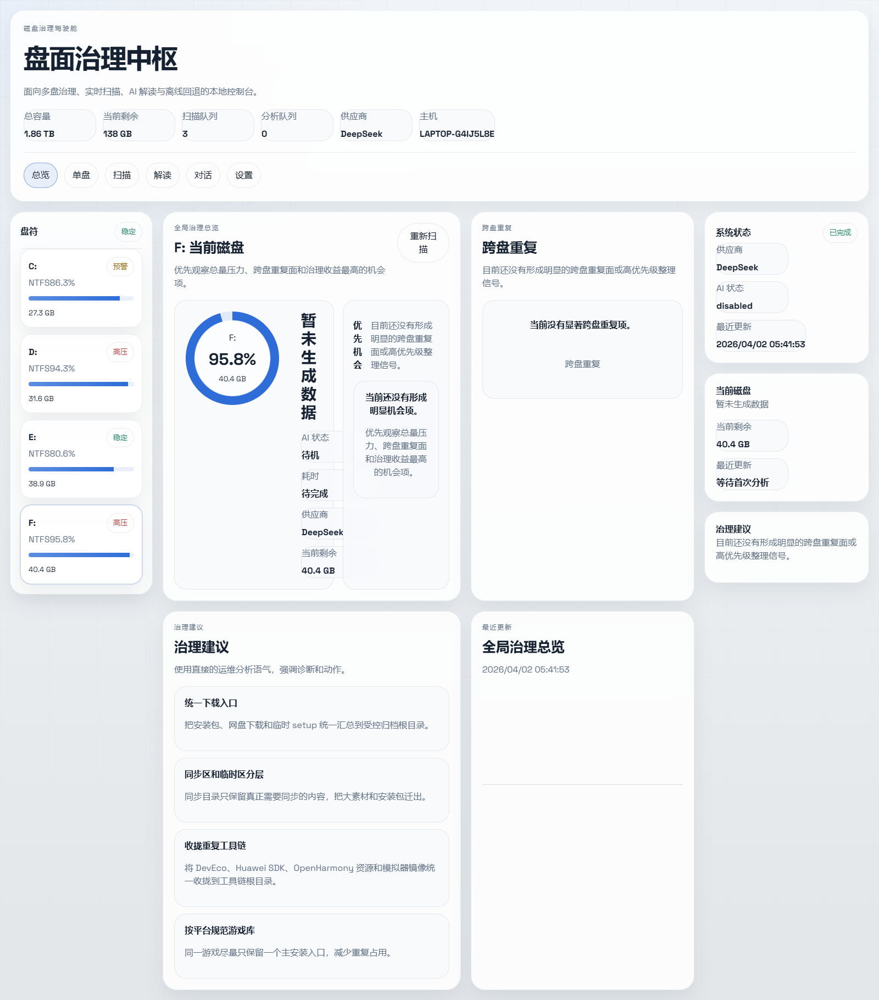
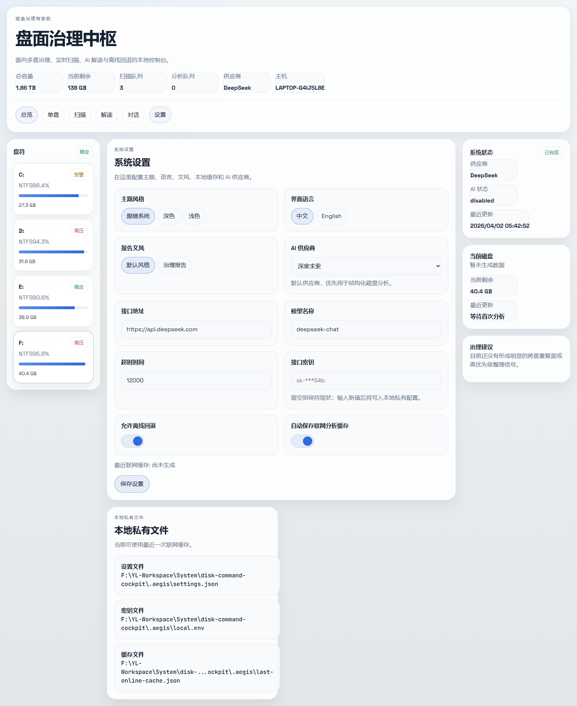

# Aegis Disk Command

[English README](./README.en.md)

[](https://github.com/XXYoLoong/aegis-disk-command/stargazers)
[](https://github.com/XXYoLoong/aegis-disk-command/network/members)
[](https://github.com/XXYoLoong/aegis-disk-command/issues)
[](https://www.microsoft.com/windows)
[](https://react.dev/)
[](https://vite.dev/)
[](https://nodejs.org/)
[](https://api-docs.deepseek.com/)

本地磁盘治理工作台，面向 Windows 电脑做实时扫描、跨盘分析、AI 解读、离线回退和多供应商配置。





## 这次版本解决了什么

- 不再针对某一台电脑硬编码路径或 API 配置
- 本地私有配置拆到 `.aegis/`，不会进入公开仓库
- 第一次联网配置完成后，会持续保存最近一次联网分析缓存，断网时可回退使用
- AI 供应商不再只有 DeepSeek，改成可切换的供应商目录
- 界面提供深色、浅色、跟随系统三种主题模式
- 界面提供中英双语切换
- 分析文风提供两种模式：
  - 默认运维风格
  - 治理报告风格，把每个磁盘当作重点治理地区来表述
- 新增设置页，用于管理主题、语言、文风、供应商、接口地址、模型、密钥和离线缓存策略

## 核心能力

### 1. 快速扫描

- 使用 `server/FastScanner.cs` 做单次遍历聚合扫描
- PowerShell 仅作为编译和调用层，不再反复递归同一批目录
- 扫描进度可视化，实时显示：
  - 当前阶段
  - 根任务进度
  - 文件数
  - 目录数
  - 已见字节
  - 当前根目录与当前路径

### 2. 多供应商 AI

当前内置供应商预设：

- 深度求索
- 通义千问
- 智谱
- 豆包
- 月之暗面
- 开放智能
- 谷歌
- 克劳德
- 开放路由
- 硅基流动

默认供应商是 `深度求索`，其它供应商可以在设置页自行切换与修改。

### 3. 本地私有配置与离线回退

本项目会在仓库根目录下创建本地私有目录：

```text
.aegis/
├─ settings.json           # 本地界面与运行设置
├─ local.env              # 本地 API 密钥，不入库
└─ last-online-cache.json # 最近一次联网分析缓存
```

规则如下：

1. 第一次建议先完成网络和 AI 配置
2. 后续每次联网分析成功后，会更新最近一次联网缓存
3. 临时断网时，系统可以回退使用最近一次联网缓存
4. 这些文件都已加入 `.gitignore`，不会被推送到公共仓库

### 4. 多界面工作台

- `总览`
- `单盘`
- `扫描`
- `解读`
- `对话`
- `设置`

不再只有一个纯大屏，而是按任务拆成不同界面。

## 项目结构

```text
disk-command-cockpit/
├─ server/
│  ├─ FastScanner.cs
│  ├─ scan-drive.ps1
│  ├─ ai-analysis.mjs
│  ├─ fallback-analysis.mjs
│  ├─ local-store.mjs
│  ├─ provider-catalog.mjs
│  └─ index.mjs
├─ src/
│  ├─ App.tsx
│  ├─ i18n.ts
│  ├─ types.ts
│  ├─ lib/format.ts
│  ├─ components/CockpitViews.tsx
│  └─ index.css
├─ docs/
│  ├─ change-highlights.md
│  ├─ step-by-step-log.md
│  └─ screenshots/
└─ .env.example
```

## 启动方式

### 1. 安装依赖

```bash
npm install
```

### 2. 开发模式

```bash
npm run dev
```

### 3. 生产模式

```bash
npm run build
npm run start
```

默认地址：

```text
http://127.0.0.1:5525
```

## 配置方式

### 优先方式：界面设置

启动后进入 `设置` 页面：

- 选择主题模式
- 选择界面语言
- 选择报告文风
- 选择 AI 供应商
- 配置接口地址、模型和密钥
- 控制离线缓存策略

### 兼容方式：环境变量

仍支持传统环境变量方式，示例见：

- [`.env.example`](./.env.example)

但现在更推荐使用设置页，因为它会把本地配置和缓存统一保存到 `.aegis/`。

## 验证结果

当前版本已验证：

- `node --check server/index.mjs`
- `node --check server/ai-analysis.mjs`
- `npm run lint`
- `npm run build`
- `/api/settings`
- `/api/providers`

同时保留了上一轮的扫描优化结果：

- 默认完整扫描 `C:` 约 `37.4 秒`

## Figma 说明

这轮需求里包含了“先在 Figma 设计再复现”。当前会话环境没有可用的 Figma MCP / 设计文件连接，所以这次没有直接写入 Figma 文件，而是先在代码里完成了新的主题、布局和设置体系。后续如果补上 Figma 连接，我可以继续把当前界面同步成 Figma 设计稿。

## 参考文档

本轮供应商和接口策略参考了各家官方文档或官方站点：

- DeepSeek Chat Completions: https://api-docs.deepseek.com/api/create-chat-completion/
- OpenAI API Docs: https://developers.openai.com/api/
- Gemini OpenAI Compatibility: https://ai.google.dev/gemini-api/docs/openai
- Anthropic Messages Examples: https://docs.anthropic.com/en/api/messages-examples
- DashScope OpenAI 兼容模式: https://help.aliyun.com/zh/model-studio/compatibility-of-openai-with-dashscope
- Moonshot 官方博客: https://platform.moonshot.cn/blog
- 火山引擎文档中心: https://www.volcengine.com/docs
- 智谱开放平台: https://open.bigmodel.cn/
